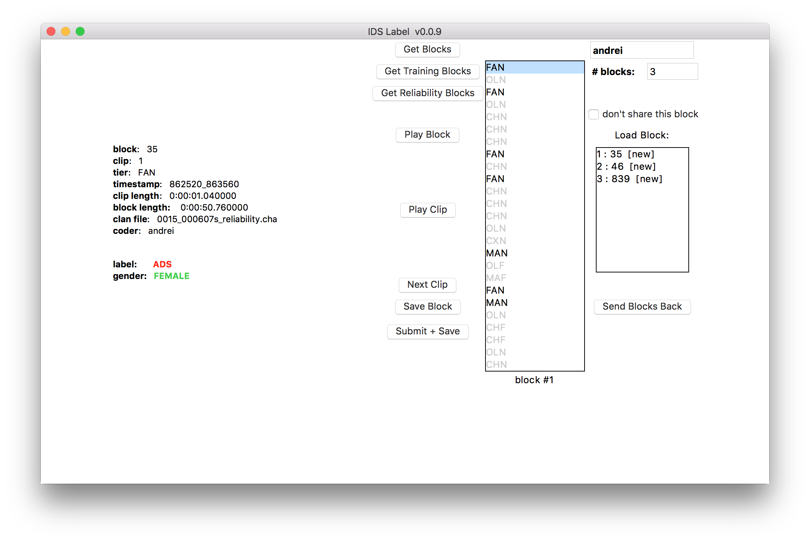
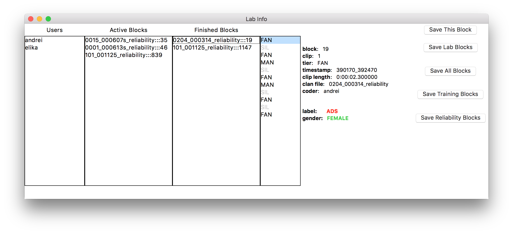

# idslabel

Note: Wiki documentation available on osf [here] (https://osf.io/d9ac4/wiki/home/) 





## requirements

This application depends on PortAudio and PyAudio.

If you're downloading the prebuilt standalone Mac App from the [releases page](https://github.com/SeedlingsBabylab/idslabel/releases), you can ignore these requirements.

#### portaudio
To install PortAudio, the easiest way is to use your operating system's package manager.

For OS X, you can use [homebrew](http://brew.sh/):
```bash
$: brew install portaudio
```

For Debian/Ubuntu Linux:
```bash
$: sudo apt-get install portaudio
```

#### pyaudio

The easiest way to install is with pip:
```bash
$: sudo pip install pyaudio
```

## usage


#### new workflow:    

- You launch the idslabel executable (double click the icon, or launch it from the command line)
- You type your name into the CODER_NAME box and press enter
 - Something should pop up asking you to set the path to the blocks directory. This is the directory where the conversation blocks will be downloaded.
 - This should be a dedicated path that you always use (try not to change it each time you run the application). When you exit the application and start it again, it'll look through the blocks already sitting there from previous sessions (unfinished, haven't submitted classifications back to the server, after submission they're deleted) and loads them again into the application so that you can continue to work on them.
 - **DO NOT DELETE THE CONTENTS IN THAT BLOCKS DIRECTORY**. Ideally, it's best not to touch that directory at all. If you want to get rid of things that are sitting there, label them within the running idslabel application and submit those classifications. The application will delete them after you submit the block.
- The application will then ask you to choose a config.json file. The value in the "lab-key" field is your lab's unique identifier.
- If you're running this for the first time, the next thing that should pop up is a message saying: "User: "xyz" doesn't exist on the server".
 - In the menu, go to File -> Add User to Server.
 - This will register that username as being a member of your lab. Next time when you type that name into the CODER_NAME box, the server will recognize it as being a registered name
- Next, press the "Get Blocks" button
 - this will ask the server to send X number of blocks to your computer
 - there are only 6 CLAN files sitting on the server right now, and it picks blocks based on whether or not the user already has a block checked out from that specific CLAN file. So, if you already have a block from 6 different clan files, the server won't be able to send you any more until you submit at least 1 of those blocks back with labels, and unlock that CLAN file from being a source of blocks.
   - There are 5146 blocks in total across these 6 CLAN files, so this should be enough to test things out for the time being. When we upload the whole dataset to the server, you'll be able to check out 20-50 (or more) blocks at a time.
   - You can set how many blocks the application will request from the server in the box labeled "# blocks". It should be set to 3 by default.
- Now, there should be a list of blocks sitting in the small box labeled "Load Block"
 - Blocks that were reloaded from previous sessions will have "old" next to them. Blocks you received in this current session will have "new" next to them
 - Double click one of these blocks to load it.
 - You can now select clips within this block to play and decide what they should be labeled as.
   - There's a small window that should pop up upon starting the idslabel application that lists all the shortcuts. The keys for selecting classifications are listed here. If you close this window, you can get it back by going to the menu (Help -> Show Shortcuts)
- You're only able to submit blocks that have every clip within them labeled.
 - Once you label every clip within a given block press the "Submit Labels to Server" button.
   - This will submit your classifications to the server, delete the block's data from the blocks directory, and remove it from the "Load Block" list.
- You can query the server to show you all the members of your lab and which blocks they're currently in possession of, and which blocks they've successfully submitted back to the server. This is in File -> Get Lab Info

#### shortcut keys

- General Keys
 - cmd   + s         : save classifications (Mac)
 - ctrl  + s         : save classifications (Linux/Windows)
 - cmd   + shift + s : save as classification (Mac)
 - ctrl  + shift + s : save as classification (Linux/Windows)

- Classification Keys
 - c : CDS
 - a : ADS
 - j : Junk

 - m : MALE
 - f : FEMALE
 - u : UNCLEAR


- Clip Keys
 - up : previous clip
 - down: next clip
 - left          : previous clip
 - right         : next clip
 - space         : play clip
 - shift + space : play whole block
